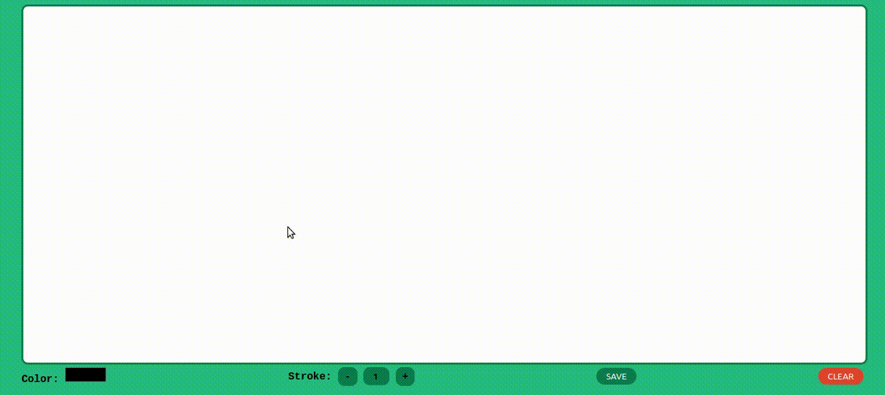

# Drawing App

This is a classic drawing web app built using the canvas element from HTML5. where you can change the line thickness and color, you can also save your drawing as and image.

## Live Link

In the following link, you can view the app [here](https://rachidelaid.github.io/drawing-app/).

## Built With

- HTML
- CSS
- JAVASCRIPT

## Getting Started

start by cloning the repository.

`git clone https://github.com/rachidelaid/drawing-app.git`

cd to the folder.

`cd drawing-app`

## Authors

👤 **Rachid El aid**

- GitHub: [@rachidelaid](https://github.com/rachidelaid)
- Twitter: [@rachidelaid1](https://twitter.com/rachidelaid1)
- LinkedIn: [Rachid El aid](https://www.linkedin.com/in/rachid-elaid-106336203/)

## 🤝 Contributing

Contributions, issues, and feature requests are welcome!

Feel free to check the [issues page](../../issues/).

## Show your support

Give a ⭐️ if you like this project!
